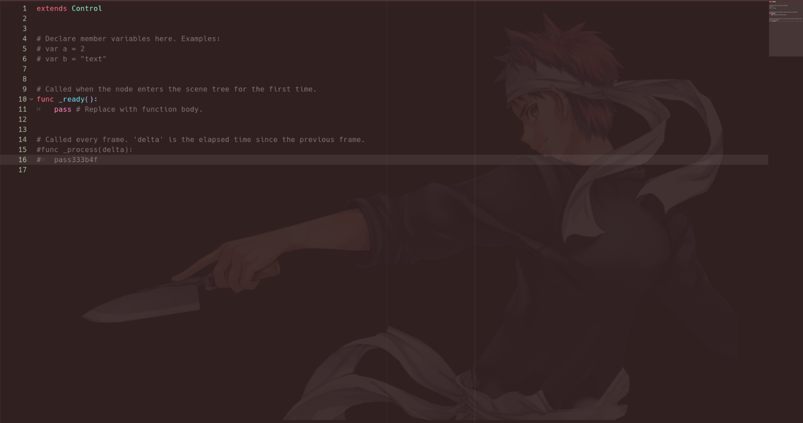
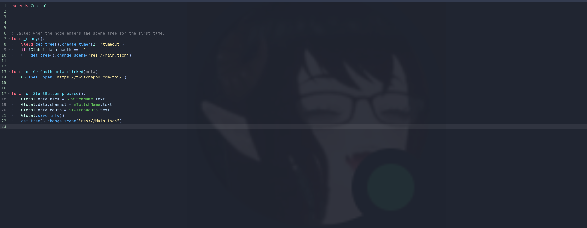

# Editor Image Plugin
 Plugin for the Godot game engine that allows you to have an image background for your code editor. The image will keep it's aspect ratio and stay centered to your code editor regardless of it's size.

## To Change the Image
To change the image shown on your background, simply open up the addons folder and replace the Background.png file with another png of your choosing. Be sure to name it Background.png to be
recognized. Opacity will be handled by the code so no need to change this in your image. I use a png to allow the option to use images with transparent backgrounds which in my opinion provide the best results.

## On Load
When you open a project with plugin already enabled, save any scene(ctrl s). If you have any errors in the output, you probably have the script for the plugin opened up, select this script and save it to resolve.

## Examples

