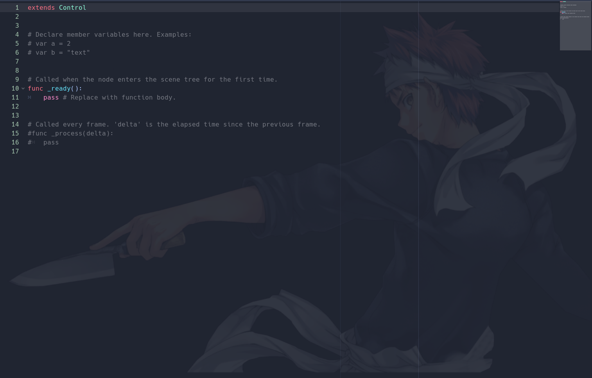

# Editor Image Plugin
 Plugin for the Godot game engine that allows you to have an image background for your code editor. The image will keep it's aspect ratio and stay centered to your code editor regardless of it's size.

## To Change the Image
To change the image shown on your background, simply open up the addons folder and replace the Background.png file with another png of your choosing. Be sure to name it Background.png to be
recognized.

## Examples

## Error on Load
If when you open a project you have an error on load, follow the on screen popup and open and save one of your scripts. Any script will do. This error occurs due to the needed part of the editor not yet existing inside of the godot interface. I have no knowledge currently for a working way to delay the assignment however, simply saving any script fixes this.